# terraform-fargate-bastion

Fargate タスクを踏み台サーバーとして使うサンプル。

## アーキテクチャー



## クライアント端末の準備

Mac に AWS CLI と Session Manager プラグインをインストールする。

```sh
brew install awscli
brew install --cask session-manager-plugin
```

Mac に psql をインストールする。

```sh
brew install libpq
echo 'export PATH="/opt/homebrew/opt/libpq/bin:$PATH"' >> ~/.zshrc
```

## 前提作業

アドバンスドインスタンスティアを有効にする。

- [アドバンストインスタンス層を有効にするには](https://docs.aws.amazon.com/ja_jp/systems-manager/latest/userguide/systems-manager-managedinstances-advanced.html)

```sh
AWS_ACCOUNT_ID=$(aws sts get-caller-identity --output text --query Account)
AWS_REGION=$(aws configure get region )
aws ssm update-service-setting \
    --setting-id arn:aws:ssm:${AWS_REGION}:${AWS_ACCOUNT_ID}:servicesetting/ssm/managed-instance/activation-tier \
    --setting-value advanced
```

Session Manager の設定で操作ログを有効にする.

- [セッションアクティビティのログ記録](https://docs.aws.amazon.com/ja_jp/systems-manager/latest/userguide/session-manager-logging.html)

## インフラストラクチャーのデプロイ

Terraform で VPC、RDS、ECS クラスターなどをデプロイする。

```sh
cd envs/dev
terraform init
terraform plan
terraform apply
```

Output に必要な情報があるので確認する。

```
ecs_cluster_name = "fargate-bastion-cluster"
ecs_task_definition_arn = "arn:aws:ecs:ap-northeast-1:123456789012:task-definition/fargate-bastion-taskdef:1"
instance_bastion_id = "i-0b06c824bbc97d579"
private_subnet_a_id = "subnet-0b2d253236f1dd021"
private_subnet_c_id = "subnet-091ccf4263c04e76b"
rds_cluster_endpoint = "fargate-bastion.cluster-cac2akggtfdd.ap-northeast-1.rds.amazonaws.com"
security_group_bastion_id = "sg-0992f3e6078155f45"
```

## Docker イメージの作成

以下リポジトリを参考にする。

- https://github.com/uma-arai/sbcntr-resources
- [Fargateタスクのコンテナ内でシェルを起動する](https://sotoiwa.hatenablog.com/entry/2020/04/27/193815)

run.sh で SSM サービスロールをしており、上記の出力と合わせること。

ECR リポジトリの作成は Terraform の外でやる。

```sh
aws ecr create-repository --repository-name bastion
```

イメージをビルドしてプッシュする。

```sh
cd ../../image
docker build -t bastion .
AWS_ACCOUNT_ID=$(aws sts get-caller-identity --output text --query Account)
AWS_REGION=$(aws configure get region)
aws ecr get-login-password | docker login --username AWS --password-stdin https://${AWS_ACCOUNT_ID}.dkr.ecr.${AWS_REGION}.amazonaws.com
docker tag bastion ${AWS_ACCOUNT_ID}.dkr.ecr.${AWS_REGION}.amazonaws.com/bastion
docker push ${AWS_ACCOUNT_ID}.dkr.ecr.${AWS_REGION}.amazonaws.com/bastion
```

## Bastion タスクの実行

タスクを実行する。

```sh
CLUSTER_NAME="fargate-bastion-cluster"
TASK_DEF_ARN="arn:aws:ecs:ap-northeast-1:123456789012:task-definition/fargate-bastion-taskdef:1"
SUBNET_ID="subnet-0b2d253236f1dd021"
SECURITY_GROUP_ID="sg-0992f3e6078155f45"
NETWORK_CONFIG="awsvpcConfiguration={subnets=[${SUBNET_ID}],securityGroups=[${SECURITY_GROUP_ID}],assignPublicIp=DISABLED}"
aws ecs run-task \
  --cluster "${CLUSTER_NAME}" \
  --task-definition "${TASK_DEF_ARN}" \
  --network-configuration "${NETWORK_CONFIG}" \
  --launch-type FARGATE
```

タスクが RUNNING になるのを確認する。

```sh
$ aws ecs list-tasks --cluster "${CLUSTER_NAME}"
{
    "taskArns": [
        "arn:aws:ecs:ap-northeast-1:123456789012:task/fargate-bastion-cluster/23fa6847954045f39645485caa8d607c"
    ]
}
$ TASK_ARN=$(aws ecs list-tasks --cluster "${CLUSTER_NAME}" | jq -r '.taskArns[0]')
$ aws ecs describe-tasks --cluster "${CLUSTER_NAME}" --tasks "${TASK_ARN}" | jq -r '.tasks[].lastStatus'
RUNNING
```

マネージドインスタンスになっていることを確認する。

```sh
$ aws ssm describe-instance-information | jq -r '.InstanceInformationList[] | select ( .Name ) | select( .Name | contains("bastion") ) | .InstanceId'
mi-06ea56560024b8b4d
```

## タスクへの接続

タスクに接続する。

```sh
$ aws ssm start-session --target mi-06ea56560024b8b4d

Starting session with SessionId: sotosugi-039da2c1e3a28edc4
sh-4.2$ whoami
ssm-user
sh-4.2$
```

## ポートフォワードの実行

ポートフォワードする。

- [AWS System Managerセッションマネージャーがリモートホストのポートフォワードに対応しました](https://dev.classmethod.jp/articles/aws-ssm-support-remote-host-port-forward/)

```sh
INSTANCE_ID=$(aws ssm describe-instance-information | jq -r '.InstanceInformationList[] | select ( .Name ) | select( .Name | contains("bastion") ) | .InstanceId' | head -1)
ENDPOINT="fargate-bastion.cluster-cac2akggtfdd.ap-northeast-1.rds.amazonaws.com"
aws ssm start-session \
    --target ${INSTANCE_ID} \
    --document-name AWS-StartPortForwardingSessionToRemoteHost \
    --parameters '{"host":["'${ENDPOINT}'"],"portNumber":["5432"], "localPortNumber":["5432"]}'
```

別のターミナルで psql を実行する。

```sh
$ psql -h localhost -p 5432 -U postgres
Password for user postgres:
psql (14.5, server 13.7)
SSL connection (protocol: TLSv1.3, cipher: TLS_AES_256_GCM_SHA384, bits: 256, compression: off)
Type "help" for help.

postgres=> SHOW SERVER_VERSION;
 server_version
----------------
 13.7
(1 row)

postgres=> SELECT AURORA_VERSION();
 aurora_version
----------------
 13.7.1
(1 row)

postgres=> \q
```
